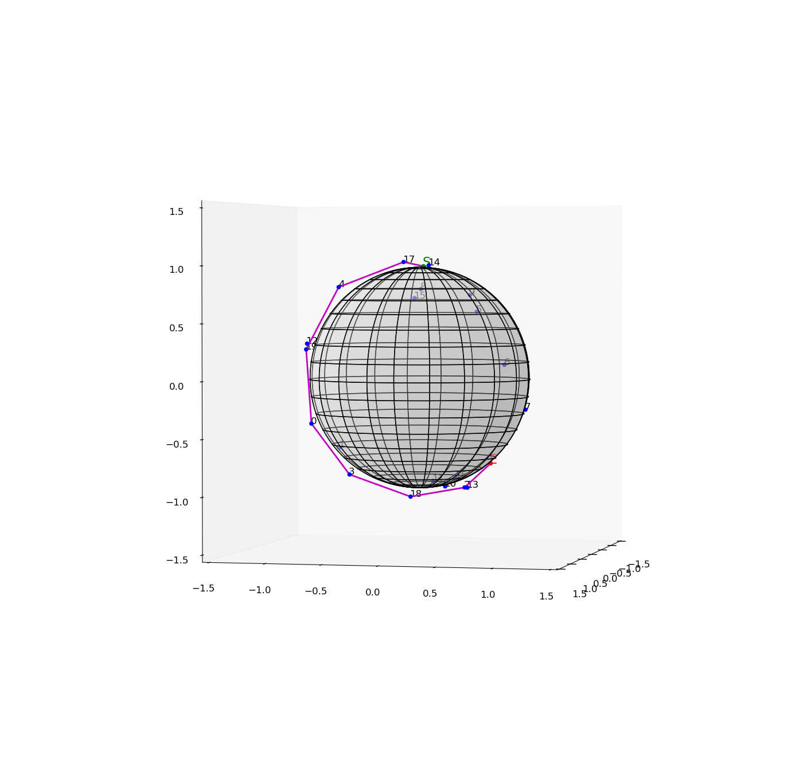

# OrbitalChallenge
[Reaktor Orbital Challenge 2016] (https://reaktor.com/orbital-challenge/) or [PDF snapshot](./reaktor_orbit_challenge2.pdf).

Find a route between the start and the end using the satellites given. A Python v3.x [solution](.sat.py). Requires [Matplotlib] (http://matplotlib.org/) and [NumPy](http://numpy.org/). Developed with [Spyder 2.3.0](https://github.com/spyder-ide/spyder) on 64-bit Linux. The data is in the input file ([puzzle.txt](./puzzle.txt)). 

Based on the idea finding the intersection between a parameterized 3D [line](https://en.wikipedia.org/wiki/Line_%28geometry%29) and a sphere. Distances are scaled towards to the [unity](https://en.wikipedia.org/wiki/Unit_sphere). The [breadth-first search](https://en.wikipedia.org/wiki/Breadth-first_search) is used to find the route. The route is printed on the [console](./out.txt). A visualization of the solution is also provided. It is possible to rotate and scale the image with a mouse. It looks like that the renderer is not able to draw the elements of the image in the right Z-order.

Other used stuff: CAS software [Mathomatic](https://launchpad.net/mathomatic) to find the intersection.  [GeoGebra](http://www.geogebra.org/) v5.x might be able to help to visualize geometric problems interactively. 
